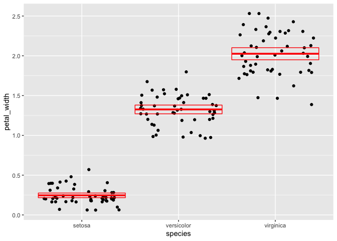

Lab 5
================
Hiba Chaudhry
02/23/2021

Objectives:

  - Rename variables

  - Create new variables

  - Summarize a dataset

  - Summarize a dataset by groups

  - Visualize the relationship between variables
    
      - Numerical and categorical variable
      - Two numerical variables
      - Three variables

<!-- end list -->

``` r
library(tidyverse)    # load the tidyverse package
```

    ## ── Attaching packages ─────────────────────────────────────── tidyverse 1.3.0 ──

    ## ✓ ggplot2 3.3.2     ✓ purrr   0.3.4
    ## ✓ tibble  3.0.4     ✓ dplyr   1.0.2
    ## ✓ tidyr   1.1.2     ✓ stringr 1.4.0
    ## ✓ readr   1.4.0     ✓ forcats 0.5.0

    ## ── Conflicts ────────────────────────────────────────── tidyverse_conflicts() ──
    ## x dplyr::filter() masks stats::filter()
    ## x dplyr::lag()    masks stats::lag()

``` r
iris <- as_tibble(iris) # so it prints a little nicer
```

\#Question 1

``` r
i2 <- rename(
  iris,
  sepal_length = Sepal.Length,
  sepal_width = Sepal.Width,
  petal_length = Petal.Length,
  petal_width = Petal.Width,
  species = Species
  )
i2
```

    ## # A tibble: 150 x 5
    ##    sepal_length sepal_width petal_length petal_width species
    ##           <dbl>       <dbl>        <dbl>       <dbl> <fct>  
    ##  1          5.1         3.5          1.4         0.2 setosa 
    ##  2          4.9         3            1.4         0.2 setosa 
    ##  3          4.7         3.2          1.3         0.2 setosa 
    ##  4          4.6         3.1          1.5         0.2 setosa 
    ##  5          5           3.6          1.4         0.2 setosa 
    ##  6          5.4         3.9          1.7         0.4 setosa 
    ##  7          4.6         3.4          1.4         0.3 setosa 
    ##  8          5           3.4          1.5         0.2 setosa 
    ##  9          4.4         2.9          1.4         0.2 setosa 
    ## 10          4.9         3.1          1.5         0.1 setosa 
    ## # … with 140 more rows

\#Question 2

``` r
numerical_mm <- mutate(i2,
                sepal_length = sepal_length * 10,
                sepal_width = sepal_width * 10,
                petal_length = petal_length * 10,
                petal_width = petal_width * 10
)

numerical_mm
```

    ## # A tibble: 150 x 5
    ##    sepal_length sepal_width petal_length petal_width species
    ##           <dbl>       <dbl>        <dbl>       <dbl> <fct>  
    ##  1           51          35           14           2 setosa 
    ##  2           49          30           14           2 setosa 
    ##  3           47          32           13           2 setosa 
    ##  4           46          31           15           2 setosa 
    ##  5           50          36           14           2 setosa 
    ##  6           54          39           17           4 setosa 
    ##  7           46          34           14           3 setosa 
    ##  8           50          34           15           2 setosa 
    ##  9           44          29           14           2 setosa 
    ## 10           49          31           15           1 setosa 
    ## # … with 140 more rows

\#Question 3

``` r
i3 <- mutate(i2, sepal_area = sepal_length * sepal_width,
             petal_area = petal_length * petal_width)
i3
```

    ## # A tibble: 150 x 7
    ##    sepal_length sepal_width petal_length petal_width species sepal_area
    ##           <dbl>       <dbl>        <dbl>       <dbl> <fct>        <dbl>
    ##  1          5.1         3.5          1.4         0.2 setosa        17.8
    ##  2          4.9         3            1.4         0.2 setosa        14.7
    ##  3          4.7         3.2          1.3         0.2 setosa        15.0
    ##  4          4.6         3.1          1.5         0.2 setosa        14.3
    ##  5          5           3.6          1.4         0.2 setosa        18  
    ##  6          5.4         3.9          1.7         0.4 setosa        21.1
    ##  7          4.6         3.4          1.4         0.3 setosa        15.6
    ##  8          5           3.4          1.5         0.2 setosa        17  
    ##  9          4.4         2.9          1.4         0.2 setosa        12.8
    ## 10          4.9         3.1          1.5         0.1 setosa        15.2
    ## # … with 140 more rows, and 1 more variable: petal_area <dbl>

\#Question 4

``` r
i4 <- summarize (i3,
            sl_sample_size = n(),
            sl_max = max(sepal_length), 
            sl_min = min(sepal_length),
            sl_range = (sl_max - sl_min),
            sl_median = median(sepal_length),
            sl_iqr = IQR(sepal_length),
            q1 = quantile(sepal_length, probs = 0.25),
            q3 = quantile(sepal_length, probs = 0.75)
             )
            i4
```

    ## # A tibble: 1 x 8
    ##   sl_sample_size sl_max sl_min sl_range sl_median sl_iqr    q1    q3
    ##            <int>  <dbl>  <dbl>    <dbl>     <dbl>  <dbl> <dbl> <dbl>
    ## 1            150    7.9    4.3      3.6       5.8    1.3   5.1   6.4

\#Question 5

``` r
i5 <- group_by(i2, species)

            
i6 <- summarize(i5, sample_size = n(),
             pw_mean = mean(petal_width),
             pw_sd = sd(petal_width),
             pw_var = var(petal_width), 
             pw_sem = pw_sd/ sqrt (n()),
             pw_ciupper = pw_mean + 1.96 * pw_sem, 
             pw_cilower = pw_mean - 1.96 * pw_sem
             )
```

    ## `summarise()` ungrouping output (override with `.groups` argument)

``` r
i6
```

    ## # A tibble: 3 x 8
    ##   species    sample_size pw_mean pw_sd pw_var pw_sem pw_ciupper pw_cilower
    ##   <fct>            <int>   <dbl> <dbl>  <dbl>  <dbl>      <dbl>      <dbl>
    ## 1 setosa              50   0.246 0.105 0.0111 0.0149      0.275      0.217
    ## 2 versicolor          50   1.33  0.198 0.0391 0.0280      1.38       1.27 
    ## 3 virginica           50   2.03  0.275 0.0754 0.0388      2.10       1.95

\#Question 6

``` r
ggplot(data = i2) + 
  geom_jitter(mapping = aes(x = species, y = petal_width))
```

<!-- -->

\#Question 7

``` r
i7 <- summarize (i5,
pw_mean = mean(petal_width),
pw_sem = sd(petal_width)/ sqrt (n()),
pw_ciupper = pw_mean + 1.96 * pw_sem, 
pw_cilower = pw_mean - 1.96 * pw_sem)
```

    ## `summarise()` ungrouping output (override with `.groups` argument)

``` r
i7
```

    ## # A tibble: 3 x 5
    ##   species    pw_mean pw_sem pw_ciupper pw_cilower
    ##   <fct>        <dbl>  <dbl>      <dbl>      <dbl>
    ## 1 setosa       0.246 0.0149      0.275      0.217
    ## 2 versicolor   1.33  0.0280      1.38       1.27 
    ## 3 virginica    2.03  0.0388      2.10       1.95

``` r
ggplot(data = i2) +
  geom_jitter(mapping = aes(x = species, y = petal_width)) +
  geom_crossbar(
    data = i7, 
    mapping = aes(x = species, y = pw_mean, ymax = pw_ciupper, 
                  ymin = pw_cilower),
    color = "red"
  )
```

<!-- -->

\#Question 8

``` r
ggplot(data = i2) +
  geom_point(mapping = aes(x = petal_length, y = petal_width , color = species))
```

<!-- -->

``` r
sessioninfo::session_info()
```

    ## ─ Session info ───────────────────────────────────────────────────────────────
    ##  setting  value                       
    ##  version  R version 4.0.3 (2020-10-10)
    ##  os       macOS Mojave 10.14.6        
    ##  system   x86_64, darwin17.0          
    ##  ui       X11                         
    ##  language (EN)                        
    ##  collate  en_US.UTF-8                 
    ##  ctype    en_US.UTF-8                 
    ##  tz       America/Chicago             
    ##  date     2021-02-23                  
    ## 
    ## ─ Packages ───────────────────────────────────────────────────────────────────
    ##  package     * version date       lib source        
    ##  assertthat    0.2.1   2019-03-21 [1] CRAN (R 4.0.2)
    ##  backports     1.2.0   2020-11-02 [1] CRAN (R 4.0.2)
    ##  broom         0.7.2   2020-10-20 [1] CRAN (R 4.0.2)
    ##  cellranger    1.1.0   2016-07-27 [1] CRAN (R 4.0.2)
    ##  cli           2.1.0   2020-10-12 [1] CRAN (R 4.0.2)
    ##  colorspace    1.4-1   2019-03-18 [1] CRAN (R 4.0.2)
    ##  crayon        1.3.4   2017-09-16 [1] CRAN (R 4.0.2)
    ##  DBI           1.1.0   2019-12-15 [1] CRAN (R 4.0.2)
    ##  dbplyr        2.0.0   2020-11-03 [1] CRAN (R 4.0.2)
    ##  digest        0.6.27  2020-10-24 [1] CRAN (R 4.0.2)
    ##  dplyr       * 1.0.2   2020-08-18 [1] CRAN (R 4.0.2)
    ##  ellipsis      0.3.1   2020-05-15 [1] CRAN (R 4.0.2)
    ##  evaluate      0.14    2019-05-28 [1] CRAN (R 4.0.1)
    ##  fansi         0.4.1   2020-01-08 [1] CRAN (R 4.0.2)
    ##  farver        2.0.3   2020-01-16 [1] CRAN (R 4.0.2)
    ##  forcats     * 0.5.0   2020-03-01 [1] CRAN (R 4.0.2)
    ##  fs            1.5.0   2020-07-31 [1] CRAN (R 4.0.2)
    ##  generics      0.1.0   2020-10-31 [1] CRAN (R 4.0.2)
    ##  ggplot2     * 3.3.2   2020-06-19 [1] CRAN (R 4.0.2)
    ##  glue          1.4.2   2020-08-27 [1] CRAN (R 4.0.2)
    ##  gtable        0.3.0   2019-03-25 [1] CRAN (R 4.0.2)
    ##  haven         2.3.1   2020-06-01 [1] CRAN (R 4.0.2)
    ##  hms           0.5.3   2020-01-08 [1] CRAN (R 4.0.2)
    ##  htmltools     0.5.0   2020-06-16 [1] CRAN (R 4.0.2)
    ##  httr          1.4.2   2020-07-20 [1] CRAN (R 4.0.2)
    ##  jsonlite      1.7.1   2020-09-07 [1] CRAN (R 4.0.2)
    ##  knitr         1.30    2020-09-22 [1] CRAN (R 4.0.2)
    ##  labeling      0.4.2   2020-10-20 [1] CRAN (R 4.0.2)
    ##  lifecycle     0.2.0   2020-03-06 [1] CRAN (R 4.0.2)
    ##  lubridate     1.7.9   2020-06-08 [1] CRAN (R 4.0.2)
    ##  magrittr      1.5     2014-11-22 [1] CRAN (R 4.0.2)
    ##  modelr        0.1.8   2020-05-19 [1] CRAN (R 4.0.2)
    ##  munsell       0.5.0   2018-06-12 [1] CRAN (R 4.0.2)
    ##  pillar        1.4.6   2020-07-10 [1] CRAN (R 4.0.2)
    ##  pkgconfig     2.0.3   2019-09-22 [1] CRAN (R 4.0.2)
    ##  purrr       * 0.3.4   2020-04-17 [1] CRAN (R 4.0.2)
    ##  R6            2.5.0   2020-10-28 [1] CRAN (R 4.0.2)
    ##  Rcpp          1.0.5   2020-07-06 [1] CRAN (R 4.0.2)
    ##  readr       * 1.4.0   2020-10-05 [1] CRAN (R 4.0.2)
    ##  readxl        1.3.1   2019-03-13 [1] CRAN (R 4.0.2)
    ##  reprex        0.3.0   2019-05-16 [1] CRAN (R 4.0.2)
    ##  rlang         0.4.8   2020-10-08 [1] CRAN (R 4.0.2)
    ##  rmarkdown     2.5     2020-10-21 [1] CRAN (R 4.0.3)
    ##  rstudioapi    0.12    2020-11-10 [1] CRAN (R 4.0.3)
    ##  rvest         0.3.6   2020-07-25 [1] CRAN (R 4.0.2)
    ##  scales        1.1.1   2020-05-11 [1] CRAN (R 4.0.2)
    ##  sessioninfo   1.1.1   2018-11-05 [1] CRAN (R 4.0.2)
    ##  stringi       1.5.3   2020-09-09 [1] CRAN (R 4.0.2)
    ##  stringr     * 1.4.0   2019-02-10 [1] CRAN (R 4.0.2)
    ##  tibble      * 3.0.4   2020-10-12 [1] CRAN (R 4.0.2)
    ##  tidyr       * 1.1.2   2020-08-27 [1] CRAN (R 4.0.2)
    ##  tidyselect    1.1.0   2020-05-11 [1] CRAN (R 4.0.2)
    ##  tidyverse   * 1.3.0   2019-11-21 [1] CRAN (R 4.0.2)
    ##  utf8          1.1.4   2018-05-24 [1] CRAN (R 4.0.2)
    ##  vctrs         0.3.4   2020-08-29 [1] CRAN (R 4.0.2)
    ##  withr         2.3.0   2020-09-22 [1] CRAN (R 4.0.2)
    ##  xfun          0.19    2020-10-30 [1] CRAN (R 4.0.2)
    ##  xml2          1.3.2   2020-04-23 [1] CRAN (R 4.0.2)
    ##  yaml          2.2.1   2020-02-01 [1] CRAN (R 4.0.2)
    ## 
    ## [1] /Library/Frameworks/R.framework/Versions/4.0/Resources/library
